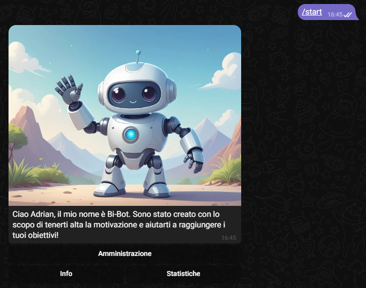
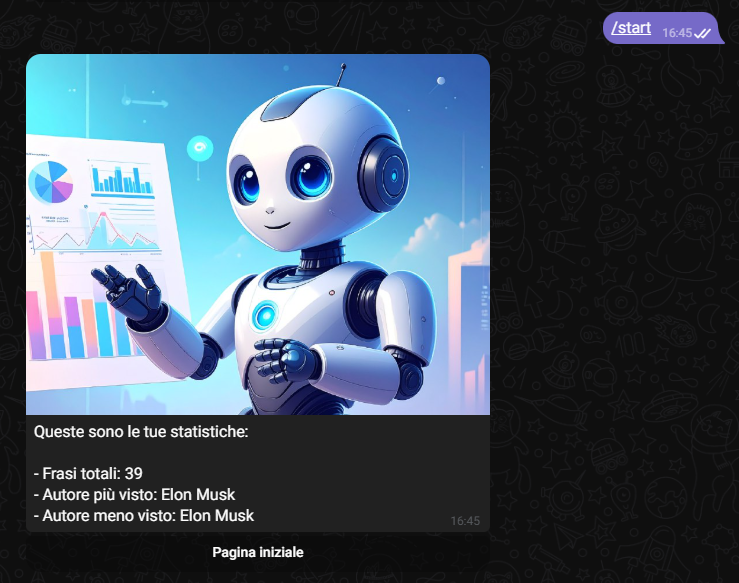
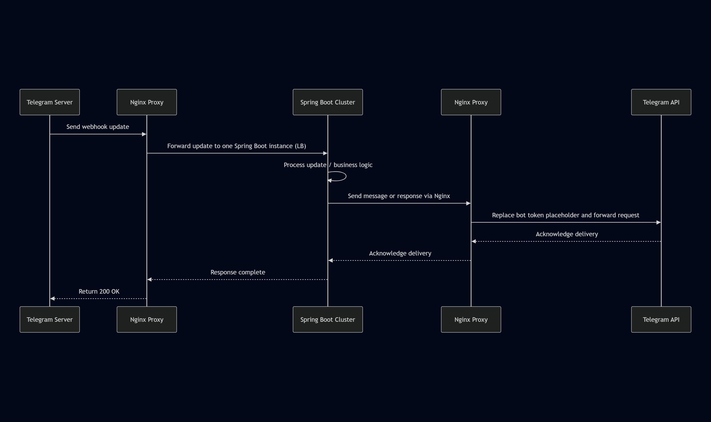
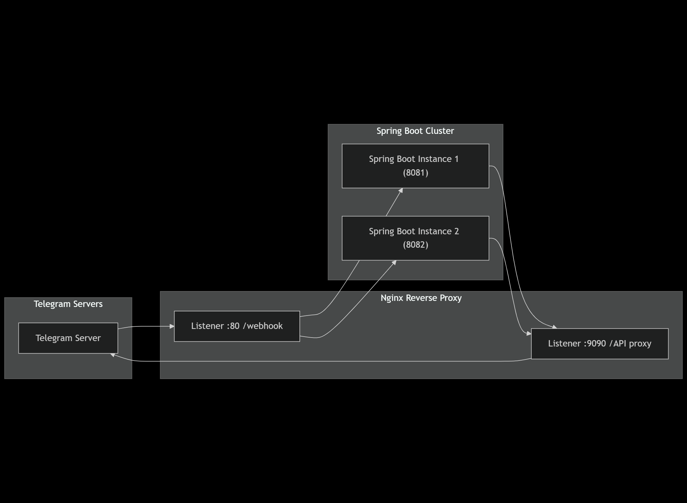
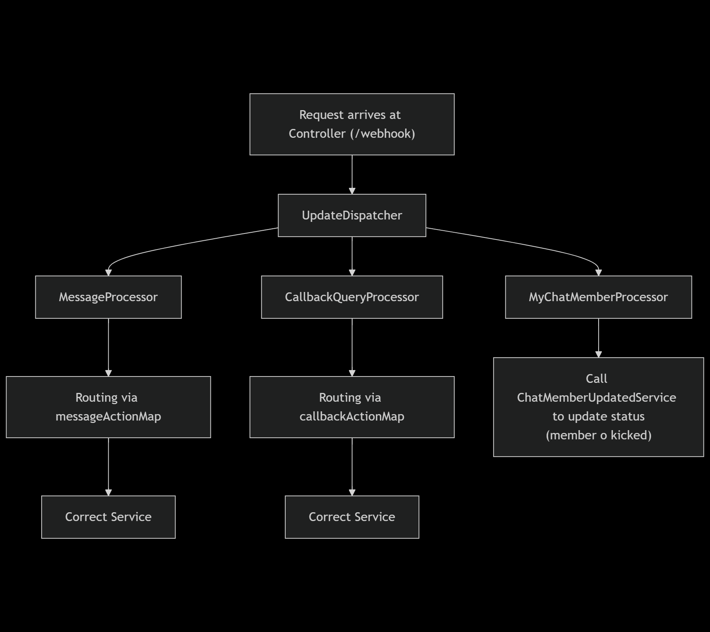
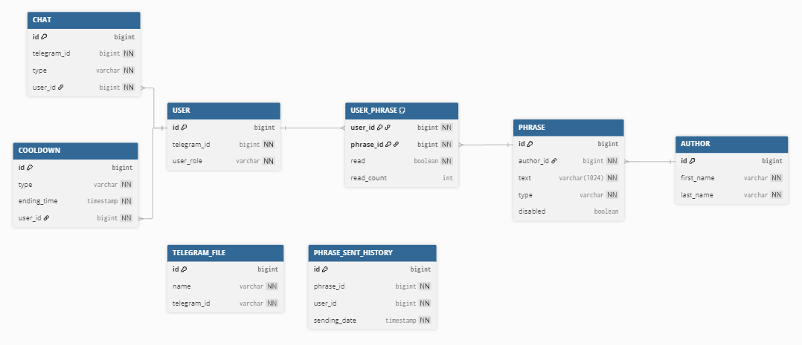

🌐 **Languages**  
[English](README.md) | [Italiano](README_it.md)

# Motivational Telegram Bot 💬✨

[](https://adoptium.net/)  
Telegram bot developed in **Java + Spring Boot**, which sends motivational quotes to users and provides interactive features.  

---

## 📖 Features
- The time zone used for scheduling is specified by the property (`motivational.telegram.bot.configuration.phrase.time-zone`).

### **Automatic Sending of Motivational Quotes**
- Managed by a **Quartz job** at configured times (`motivational.telegram.bot.configuration.phrase.sending-times`).
- To prevent duplication in case of multiple application instances, a **distributed lock** is used via **Redisson**.

### `/start`
- Starts the bot and shows the main menu.  
- All sections (Info, Statistics, Admin) **update the existing message** instead of sending a new one.  


### Interactive Menu
- **Info Section** → shows general information about the bot.  
  
- **Statistics Section** → shows personal statistics (e.g., number of quotes received).  
  
- **Admin Section** → bot administration
  
  - upload quotes via CSV.  
    - Required CSV file with header (order does not matter):  
      ```
      AUTHOR_FIRST_NAME, AUTHOR_LAST_NAME, TEXT, BIOGRAPHY
      ```
    - Also possible via the `/loadfilephrases` command.

## Communication with Telegram
- All messages sent by Telegram users to the Spring Boot application are handled via **webhook**.  
- The logic is located in:  
  ```
  it.vrad.motivational.telegram.bot.infrastructure.web.controller.TelegramApi
  ```
- This allows real-time updates without continuous polling.

### 🔄 Request Flow

*Source: [request-sequence-diagram](docs/mermaid/request-sequence-diagram.txt)*

### 🌐 Network Architecture

*Source: [network-architecture-flowchart](docs/mermaid/network-architecture-flowchart.txt)*

#### Technical Details
- **Nginx**
    - Configured in [`nginx.conf`](config/nginx.conf)
    - Handles **load balancing** and **request routing**

- **Ingress**
    - All incoming messages pass through the **webhook** listening on port `:80`

- **Egress**
    - Outgoing calls to the **Telegram API** go through the listener on `:9090`
    - Here, the **token placeholder** is replaced with the real value

- **Spring Boot**
    - Can scale with multiple instances in a **cluster**
    - Distribution managed by Nginx using the **least_conn** algorithm

---

## 💬 Available Commands
| Command            | Description                                                                                      | Notes                                                                                                                     |
|--------------------|--------------------------------------------------------------------------------------------------|--------------------------------------------------------------------------------------------------------------------------|
| `/start`           | Starts the bot, shows the main menu, and allows navigation between Info, Statistics, Admin       | Navigation between pages updates the existing message, without creating a new one                                         |
| `/randomphrase`    | Returns a random motivational quote                                                              | Subject to configurable cooldown (`motivational.telegram.bot.configuration.cooldown.cooldown-duration-map.RANDOM_PHRASE`)|
| `/loadfilephrases` | Upload motivational quotes via CSV file                                                          |                                                                                                                          |

---

## 🔑 Admin Management
- The only way to become admin is to **manually modify the DB**, assigning the `ADMIN` role to the user.

---

## ⚙️ Project Setup

### 1. Requirements
- **JDK 21+**
- **Maven 3.9+**
- **Relational Database** (PostgreSQL, MySQL or H2 for development)
- **Docker** (required for running the IntegrationTest)
- Telegram Bot Token (obtained from [BotFather](https://core.telegram.org/bots#botfather))

### 2. Available Profiles
The project supports two profiles: `dev` and `prod`.  
The profile to use must be specified via the environment variable:
```bash
SPRING_PROFILES_ACTIVE=dev   # or prod
```

#### `dev` Profile
- Main configuration in `application-dev.properties`.  
- You can **avoid using a proxy** and point directly to Telegram servers by changing the relevant properties in:  
  ```
  config/dev/api-dev.properties
  ```

#### `prod` Profile
- Main configuration in `application-prod.properties`.  
- In addition to setting the profile via `SPRING_PROFILES_ACTIVE=prod`, you must specify Redis and database credentials via environment variables:  
  ```bash
  REDIS_USERNAME=<redis_username>
  REDIS_PASSWORD=<redis_password>
  DB_USERNAME=<db_username>
  DB_PASSWORD=<db_password>
  SERVER_PORT=<port_number> # optional
  ```
### 3. Clone the Project
```bash
git clone https://github.com/userAdrian/motivational-telegram-bot.git
```

### 4. Database
- SQL creation scripts are located in the `database/` folder.  
- Make sure the database credentials are set correctly via environment variables or in the `application-<profile>.properties` file.

### 5. Start the Project

Unix / macOS (bash):

```bash
    SPRING_PROFILES_ACTIVE=profile \
    REDIS_USERNAME=your_redis_username \
    REDIS_PASSWORD=your_redis_password \
    DB_USERNAME=your_db_user \
    DB_PASSWORD=your_db_password \
    SERVER_PORT=server_port \
    mvn spring-boot:run
```

Windows (CMD):

```cmd
set SPRING_PROFILES_ACTIVE=profile
set REDIS_USERNAME=your_redis_username
set REDIS_PASSWORD=your_redis_password
set DB_USERNAME=your_db_user
set DB_PASSWORD=your_db_password
set SERVER_PORT=server_port
mvn spring-boot:run
```

The project will read the profile specified via `SPRING_PROFILES_ACTIVE` and use the dedicated settings.

## Deployment with Docker

- [Dockerfile](Dockerfile) with instructions to create the docker image

### Build the project

Unix / macOS (bash) / Windows (CMD):

```bash
  mvn package
```

> **Note:**
> - Ensure `mvn package` completes successfully before building a Docker image.
> - For faster local iterations you can run `mvn -DskipTests package` to skip tests (use with caution).

### Create the image

Unix / macOS (bash) / Windows (CMD):

```bash
  docker build -t motivational-telegram-bot:latest .
```

- `-t` tags the image (name[:tag]) so you can refer to it when running.

### Run the container

Unix / macOS (bash):

```bash
    docker run -d --name motivational-telegram-bot \
      -e SPRING_PROFILES_ACTIVE=profile \
      -e REDIS_USERNAME=your_redis_username -e REDIS_PASSWORD=your_redis_password \
      -e DB_USERNAME=your_db_user -e DB_PASSWORD=your_db_password \
      -e SERVER_PORT=container_port \
      -p host_port:container_port \
      --restart unless-stopped \
      motivational-telegram-bot:latest
```

Windows (CMD):

```cmd
docker run -d --name motivational-telegram-bot ^
  -e SPRING_PROFILES_ACTIVE=profile ^
  -e REDIS_USERNAME=your_redis_username -e REDIS_PASSWORD=your_redis_password ^
  -e DB_USERNAME=your_db_user -e DB_PASSWORD=your_db_password ^
  -e SERVER_PORT=container_port ^
  -p host_port:container_port ^
  --restart unless-stopped ^
  motivational-telegram-bot:latest
```

#### Notes

- Replace `container_port` with the port the application listens on.
- If you set `SERVER_PORT` as an environment variable inside the container, it must match the container port used in
  `-p host_port:container_port` (the `-p` mapping controls host-to-container networking).
- `-p host_port:container_port` maps a host port to the container port. Example: `-p 8080:8080`.
- `--restart unless-stopped` means the container will restart on Docker daemon restarts and on crashes, but it will
  **not** restart if you manually stopped it.

When the container needs to access services on the host, replace `localhost` with `host.docker.internal` wherever necessary

---

## 📂 General Project Structure
```
motivational-telegram-bot/
│── src/main/java/it/vrad/motivational/telegram/bot
│   ├── config/         # Spring configurations (beans, properties, schedulers)
│   ├── core/           # Main business logic
│   ├── infrastructure/ # Technical support services
│   ├── integration/    # Communication with external services (Telegram, API)
│   ├── shared/         # Common utilities and reusable components across the project
│
│── database/           # SQL scripts for DB creation
│── config/             # Any extra configuration
│── docs/images/        # Screenshots used in the README
│── pom.xml             # Maven configuration
│── README.md           # Project documentation
```
### Telegram Update Flow
  
*Source: [update-flowchart](docs/mermaid/update-flowchart.txt)*

#### Technical Details
- The `UpdateDispatcher` is defined in [`DispatcherConfig.updateDispatcher`](src/main/java/it/vrad/motivational/telegram/bot/config/DispatcherConfig.java)
    - The input map (`updateProcessorMap`) is automatically populated by **Spring**
    - The bean name of the processor **must** match the corresponding enum: [`UpdateProcessorType`](src/main/java/it/vrad/motivational/telegram/bot/core/model/enums/UpdateProcessorType.java)

- The action maps are defined in [`ActionsConfig`](src/main/java/it/vrad/motivational/telegram/bot/config/ActionsConfig.java)
    - **`messageActionMap`**
    - **`callbackActionMap`**

### Database Schema

*Source: [db-schema](docs/dbdiagram/db-schema.txt)*

#### Entity Notes
- **`user_phrase`**
    - `read` → `1` if the phrase has been sent, `0` otherwise
    - `read_count` → number of times the phrase has been sent to the user

- **`phrase`**
    - `disabled` → `1` if the phrase has been disabled, `0` otherwise
    - `type` → type of phrase (e.g., `BIOGRAPHY`, etc.)
        - see [`PhraseType`](src/main/java/it/vrad/motivational/telegram/bot/core/model/enums/persistence/PhraseType.java)
---

## 🚀 Future Ideas
- 🔜 Command to promote a user to admin without modifying the DB.
- 🔜 Dynamic configuration of phrase sending times.
- 🔜 User-customizable time zone.
