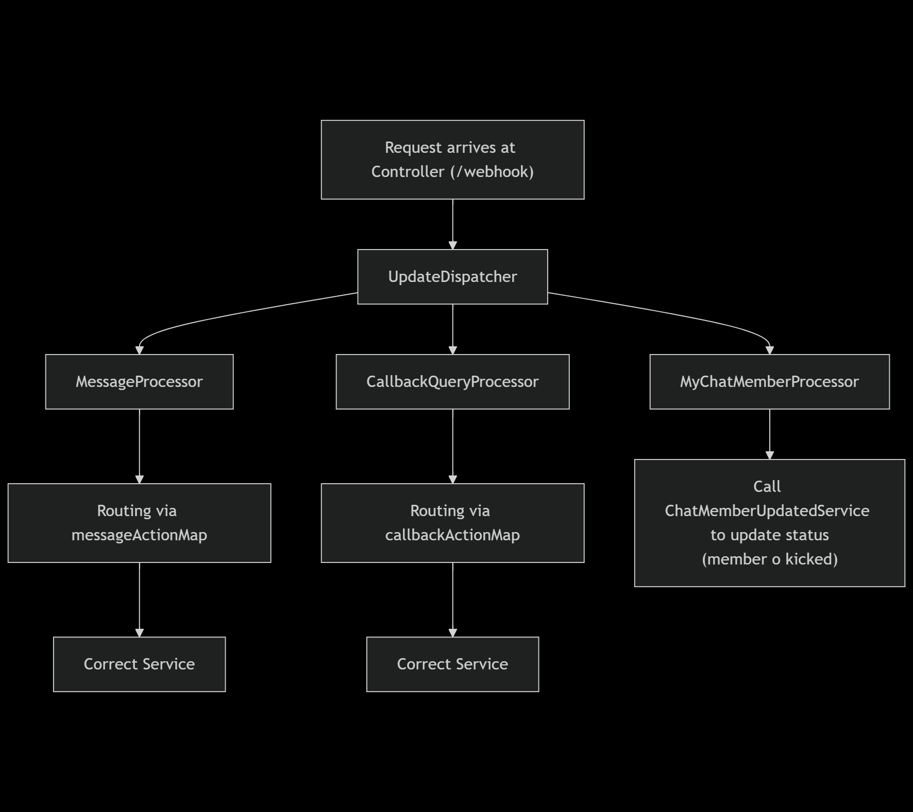
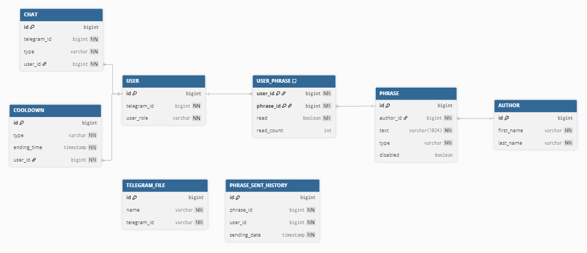

🌐 **Lingue**  
[English](README.md) | [Italiano](README_it.md)

# Motivational Telegram Bot 💬✨

[](https://adoptium.net/)  
Bot Telegram sviluppato in **Java + Spring Boot**, che invia frasi motivazionali agli utenti e fornisce funzionalità interattive.  

---

## 📖 Funzionalità
- Il fuso orario utilizzato per la pianificazione è specificato dalla property (`property motivational.telegram.bot.configuration.phrase.time-zone`).

### **Invio automatico frasi motivazionali**
- Avviene tramite un **job Quartz** agli orari configurati (`motivational.telegram.bot.configuration.phrase.sending-times`).
- Per prevenire duplicazioni in caso di più istanze dell’applicativo, viene utilizzato un **distributed lock** tramite **Redisson**.

### `/start`
- Avvia il bot e mostra il menu principale.  
- Tutte le sezioni (Info, Statistiche, Admin) aggiornano **il messaggio esistente** anziché inviarne uno nuovo.  


### Menu interattivo
- **Sezione Info** → mostra informazioni generali sul bot.  
  
- **Sezione Statistiche** → mostra le statistiche personali (es. numero frasi ricevute).  
  
- **Sezione Admin** → amministrazione del bot
  
  - caricamento frasi tramite CSV.  
    - File CSV richiesto con header (l'ordine non importa):  
      ```
      AUTHOR_FIRST_NAME, AUTHOR_LAST_NAME, TEXT, BIOGRAPHY
      ```
    - Possibile anche tramite comando `/loadfilephrases`.

## Comunicazione con Telegram
- Tutti i messaggi inviati dagli utenti Telegram verso l’applicativo Spring Boot vengono gestiti tramite **webhook**.  
- La logica è presente in:  
  ```
  it.vrad.motivational.telegram.bot.infrastructure.web.controller.TelegramApi
  ```
- Questo permette di ricevere aggiornamenti in tempo reale senza fare polling continuo.

### 🔄 Flusso delle richieste

*Fonte: [request-sequence-diagram](docs/mermaid/request-sequence-diagram.txt)*

### 🌐 Architettura di rete

*Fonte: [network-architecture-flowchart](docs/mermaid/network-architecture-flowchart.txt)*

#### Dettagli tecnici
- **Nginx**
    - Configurato in [`nginx.conf`](config/nginx.conf)
    - Gestisce **load balancing** e **routing** delle richieste

- **Ingresso**
    - Tutti i messaggi entranti passano dal **webhook** in ascolto sulla porta `:80`

- **Uscita**
    - Le chiamate in uscita verso le **Telegram API** transitano dal listener `:9090`
    - Qui viene sostituito il **placeholder del token** con il valore reale

- **Spring Boot**
    - Può scalare con più istanze in **cluster**
    - Distribuzione gestita da Nginx tramite algoritmo **least_conn**

---

## 💬 Comandi disponibili
| Comando            | Descrizione                                                                                    | Note                                                                                                                       |
|--------------------|------------------------------------------------------------------------------------------------|----------------------------------------------------------------------------------------------------------------------------|
| `/start`           | Avvia il bot, mostra il menu principale e permette la navigazione tra Info, Statistiche, Admin | La navigazione tra le pagine aggiorna il messaggio esistente, senza crearne uno nuovo                                      |
| `/randomphrase`    | Restituisce una frase motivazionale casuale                                                    | Soggetto a cooldown configurabile (`motivational.telegram.bot.configuration.cooldown.cooldown-duration-map.RANDOM_PHRASE`) |
| `/loadfilephrases` | Caricamento di frasi motivazionali tramite file CSV                                            |                                                                                                                            |

---

## 🔑 Gestione Admin
- L’unico modo per diventare admin è **modificare manualmente il DB**, assegnando all’utente il ruolo `ADMIN`.

---

## ⚙️ Setup del progetto

### 1. Requisiti
- **JDK 21+**
- **Maven 3.9+**
- **Database relazionale** (PostgreSQL, MySQL o H2 per sviluppo)
- **Docker** (richiesto per il lancio degli IntegrationTest)
- Token Telegram Bot (ottenuto da [BotFather](https://core.telegram.org/bots#botfather))

### 2. Profili disponibili
Il progetto supporta due profili: `dev` e `prod`.  
Il profilo da usare va indicato tramite la variabile d'ambiente:
```
SPRING_PROFILES_ACTIVE=dev   # oppure prod
```

#### Profilo `dev`
- Configurazione principale in `application-dev.properties`.  
- È possibile **evitare l'uso di un proxy** e puntare direttamente ai server Telegram cambiando le relative properties in:  
  ```
  config/dev/api-dev.properties
  ```

#### Profilo `prod`
- Configurazione principale in `application-prod.properties`.  
- Oltre a impostare il profilo tramite `SPRING_PROFILES_ACTIVE=prod`, è necessario specificare le credenziali per Redis e per il database tramite variabili d'ambiente:  
  ```
  REDIS_USERNAME=<username_redis>
  REDIS_PASSWORD=<password_redis>
  DB_USERNAME=<username_db>
  DB_PASSWORD=<password_db>
  SERVER_PORT=<numero_porta> # opzionale
  ```
### 3. Clonazione del progetto
```bash
git clone https://github.com/userAdrian/motivational-telegram-bot.git
```

### 4. Database
- Gli script SQL di creazione si trovano nella cartella `database/`.  
- Assicurati che le credenziali del database siano impostate correttamente tramite le environment variables o nel file `application-<profilo>.properties`.

### 5. Avvio del progetto

Unix / macOS (bash):

```bash
    SPRING_PROFILES_ACTIVE=profile \
    REDIS_USERNAME=your_redis_username \
    REDIS_PASSWORD=your_redis_password \
    DB_USERNAME=your_db_user \
    DB_PASSWORD=your_db_password \
    SERVER_PORT=server_port \
    mvn spring-boot:run
```

Windows (CMD):

```cmd
set SPRING_PROFILES_ACTIVE=profile
set REDIS_USERNAME=your_redis_username
set REDIS_PASSWORD=your_redis_password
set DB_USERNAME=your_db_user
set DB_PASSWORD=your_db_password
set SERVER_PORT=server_port
mvn spring-boot:run
```

Il progetto leggerà il profilo specificato tramite `SPRING_PROFILES_ACTIVE` e utilizzerà le impostazioni dedicate.

## Distribuzione con Docker

- [Dockerfile](Dockerfile) con istruzioni per creare l'immagine Docker

### Build del progetto

Unix / macOS (bash) / Windows (CMD):

```bash
mvn package
```

> **Nota:**
> - Assicurati che `mvn package` completi correttamente prima di costruire l'immagine Docker.
> - Per iterazioni locali più veloci puoi eseguire `mvn -DskipTests package` per saltare i test (usalo con cautela).

### Creare l'immagine

Unix / macOS (bash) / Windows (CMD):

```bash
docker build -t motivational-telegram-bot:latest .
```

- `-t` etichetta l'immagine (name[:tag]) così puoi riferirti ad essa al momento dell'esecuzione.

### Avviare il container

Unix / macOS (bash):

```bash
docker run -d --name motivational-telegram-bot \
  -e SPRING_PROFILES_ACTIVE=profile \
  -e REDIS_USERNAME=your_redis_username -e REDIS_PASSWORD=your_redis_password \
  -e DB_USERNAME=your_db_user -e DB_PASSWORD=your_db_password \
  -p host_port:container_port \
  --restart unless-stopped \
  motivational-telegram-bot:latest
```

Windows (CMD):

```cmd
docker run -d --name motivational-telegram-bot ^
  -e SPRING_PROFILES_ACTIVE=profile ^
  -e REDIS_USERNAME=your_redis_username -e REDIS_PASSWORD=your_redis_password ^
  -e DB_USERNAME=your_db_user -e DB_PASSWORD=your_db_password ^
  -p host_port:container_port ^
  --restart unless-stopped ^
  motivational-telegram-bot:latest
```

#### Note

- Sostituisci `container_port` con la porta su cui l'applicazione ascolta.
- Se imposti `SERVER_PORT` come variabile d'ambiente all'interno del container, deve corrispondere alla porta container
  usata in `-p host_port:container_port` (la mappatura `-p` controlla il networking host->container).
- `-p host_port:container_port` mappa una porta dell'host alla porta del container (esempio: `-p 8080:8080`).
- `--restart unless-stopped` riavvia il container quando il daemon Docker viene riavviato o in caso di crash, ma **non**
  lo riavvia se lo hai fermato manualmente.

Quando il container deve accedere ai servizi sulla macchina host, sostituisci `localhost` con `host.docker.internal`
dove necessario

---

## 📂 Struttura generale del progetto
```
motivational-telegram-bot/
│── src/main/java/it/vrad/motivational/telegram/bot
│   ├── config/         # Configurazioni Spring (bean, properties, schedulers)
│   ├── core/           # Logica di business principale
│   ├── infrastructure/ # Servizi di supporto tecnico
│   ├── integration/    # Comunicazione con servizi esterni (Telegram, API)
│   ├── shared/         # Utilità e componenti comuni riusabili in tutto il progetto
│
│── database/           # Script SQL per la creazione del DB
│── config/             # Eventuali configurazioni extra
│── docs/images/        # Screenshot usati nel README
│── pom.xml             # Configurazione Maven
│── README.md           # Documentazione del progetto
```
### Flusso Telegram Update
  
*Fonte: [update-flowchart](docs/mermaid/update-flowchart.txt)*

#### Dettagli tecnici
- L’`UpdateDispatcher` è definito in [`DispatcherConfig.updateDispatcher`](src/main/java/it/vrad/motivational/telegram/bot/config/DispatcherConfig.java)
    - La mappa in input (`updateProcessorMap`) viene popolata automaticamente da **Spring**
    - Il nome del bean del processor **deve** corrispondere al relativo enum: [`UpdateProcessorType`](src/main/java/it/vrad/motivational/telegram/bot/core/model/enums/UpdateProcessorType.java)

- Le mappe delle azioni sono definite in [`ActionsConfig`](src/main/java/it/vrad/motivational/telegram/bot/config/ActionsConfig.java)
    - **`messageActionMap`**
    - **`callbackActionMap`**

### Schema del database

*Fonte: [db-schema](docs/dbdiagram/db-schema.txt)*

#### Note sulle entità
- **`user_phrase`**
    - `read` → `1` se la frase è stata mandata, `0` altrimenti
    - `read_count` → numero di volte che la frase è stata inviata all’utente

- **`phrase`**
    - `disabled` → `1` se la frase è stata disabilitata, `0` altrimenti
    - `type` → tipologia della frase (es. `BIOGRAPHY`, ecc.)
        - vedi [`PhraseType`](src/main/java/it/vrad/motivational/telegram/bot/core/model/enums/persistence/PhraseType.java)
---

## 🚀 Idee future
- 🔜 Comando per promuovere un utente ad admin senza modificare il DB.
- 🔜 Configurazione dinamica degli orari per invio delle frasi
- 🔜 Time zone personalizzabile dall’utente.